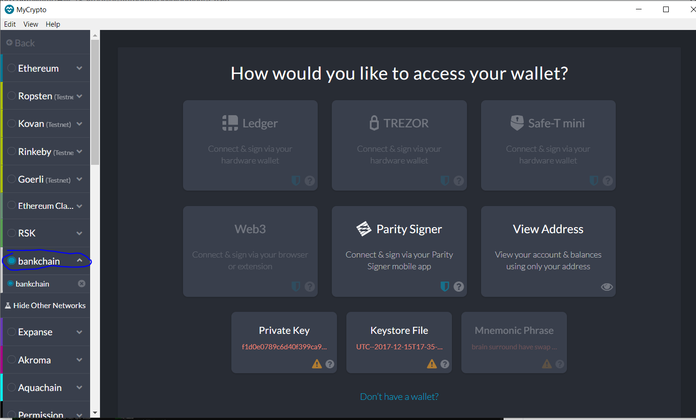
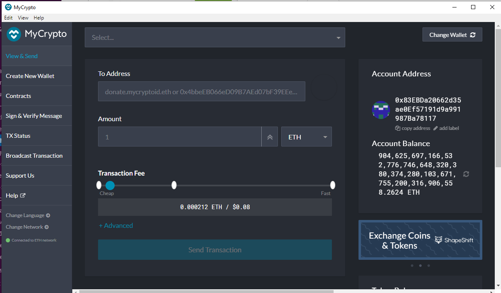

# Bank-Chain Network

## Dependencies:

 - gith

 - puppeth

# Use the nodes:

 1. Open git bash within the blockchain tool directory and execute the commade for node one below to start the mining process.  This will require a password to be entered:

        geth --datadir node1 --unlock "0xA3ace316DC18F6D5e67c4FD418Fe686A175bd67a" --mine --rpc --allow-insecure unlock

 2. Open a second gitbach window and enable mining to node2.  Use the code below to start the process.  This will use the encode address from node 1.  This will also require a password to be entered.

        geth --datadir node2 --unlock "0xA3ace316DC18F6D5e67c4FD418Fe686A175bd67a" --mine --port 30304 --bootnodes enode: 2811c4a904adef3edf6f3cb966f2a123f1da8c84ca7990f77029d79b5dc118413c5787c0fa184c9052abd63d183e6fb0cb6086eaebc51f448dffdbcc90098327@127.0.0.1:30303 --ipcdisable --allow-insurue-unlock

- Password: 
    - Node 1: node1
    - Node 2  node2

# How to connect Mycrypto to the blockchain netowrk:

1. Open MyCrypto and set up a custom node under "Add Custom Node"

2. Enter the information below per the screen shot:

3. Save the Customer Node.

4. Navegate to the "Change Network" icon and connect to the custom blockchain network (bankchain)

5. Select the "Keystore File" icon and brouse to the Keystore File for node1 on your local machine.  Select the file and enter the node password.

6. The account should be funded as below:

# How to send a transaction:

1. Under "View & Send", type the address of the account which you would like to send a transaction.  Complete the amount and, when finished, send the transaction.

2. Click on the transaction hash to view the transaction. 

 # Screenshots (Network Configuration):

1. Create the network name (bankchain) and genesis block using puppeth

2. Using geth create two nodes on the network (node1 & node2).

3. Mining nodes 1 and 2

4. Create a custom network

5. Pending Transaction from Node 1 to Node 2

