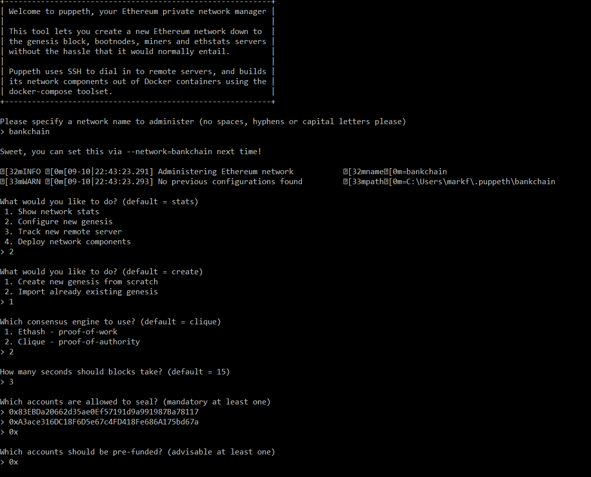
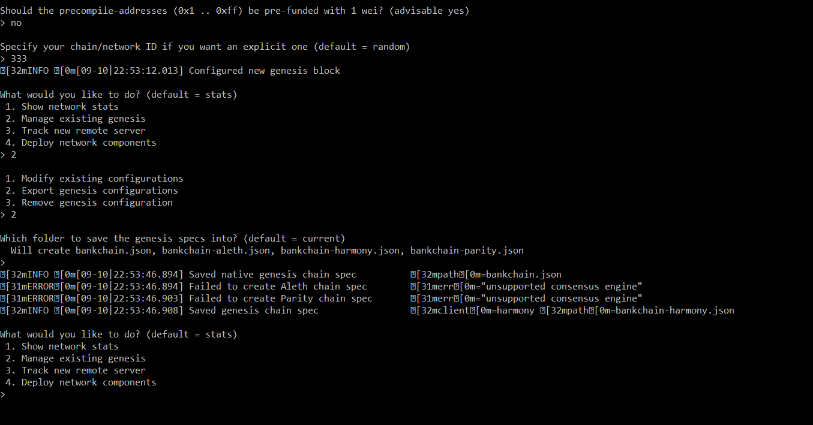
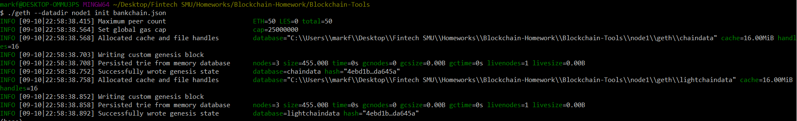
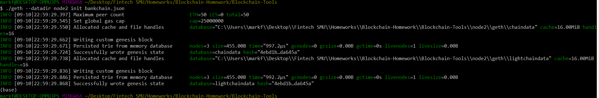
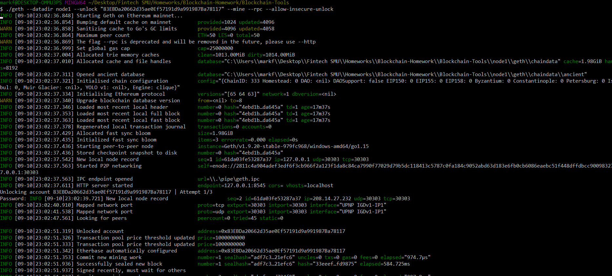
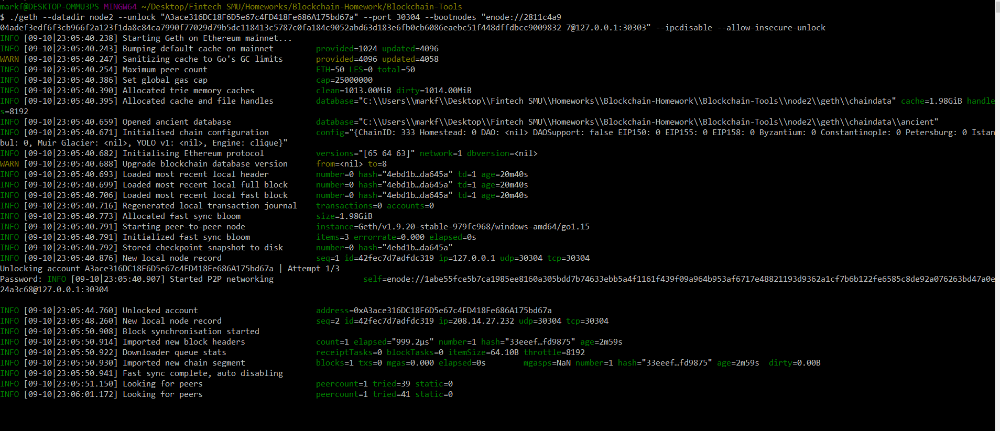
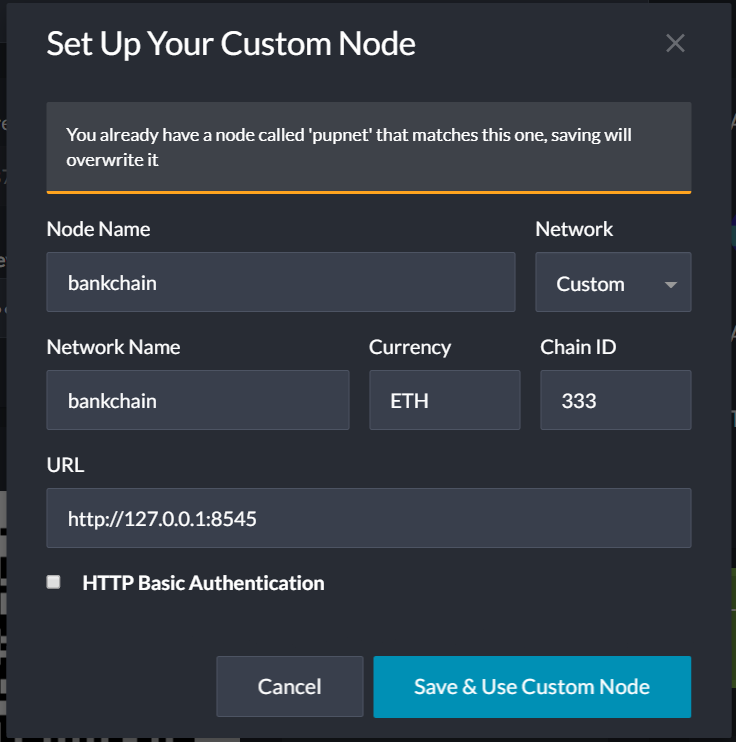
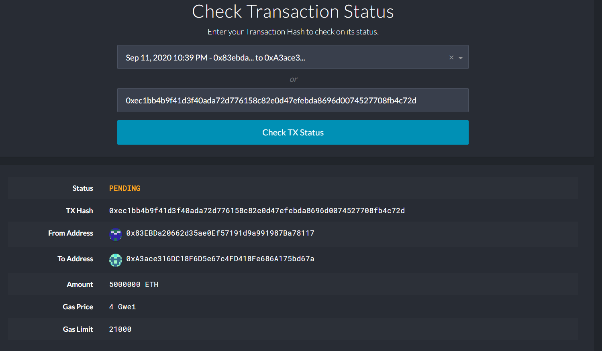

# Bank-Chain Network

## Dependencies:

 - gith

 - puppeth

 ## Instructions:

1. Create the network name (bankchain) and genesis block using puppeth

2. Using geth create two nodes on the network (node1 & node2).

3. Mining nodes 1 and 2

4. Create a custom network

5. Pending Transaction from Node 1 to Node 2

